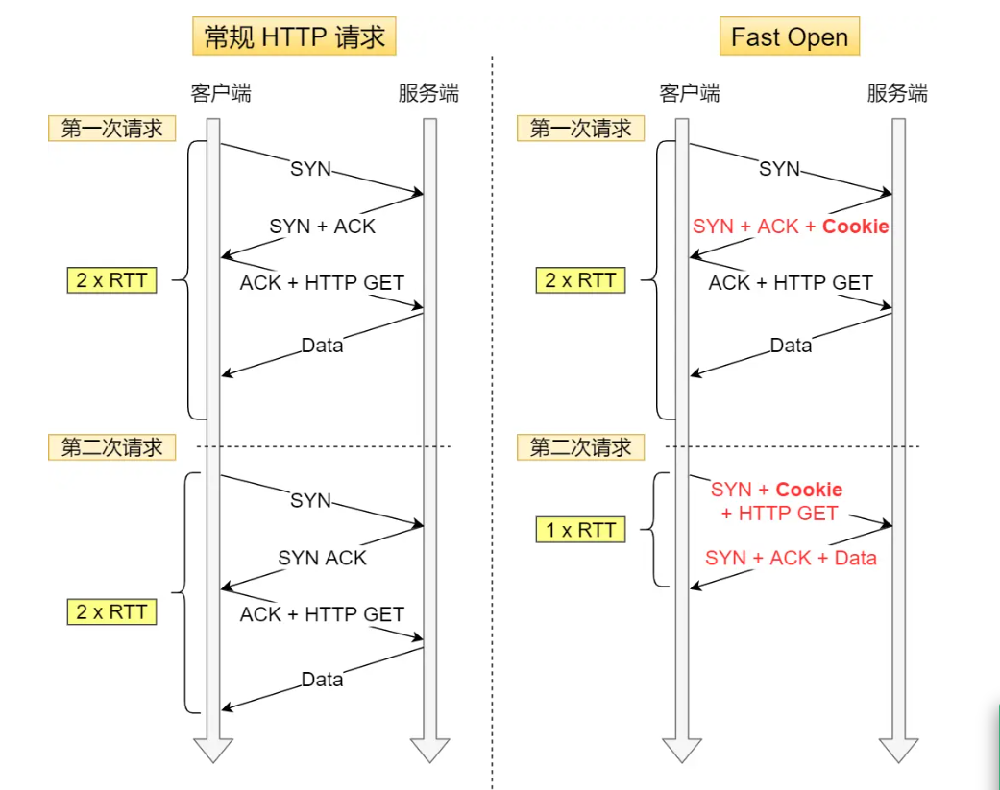

# TCP快速建立连接（fast open）

* 在第一次建立连接的时候，服务端在第二次握手产生一个 `Cookie` （已加密）并通过 SYN、ACK 包一起发给客户端，于是客户端就会缓存这个 `Cookie`，所以第一次发起 HTTP Get 请求的时候，还是需要 2 个 RTT 的时延；
* 在下次请求的时候，客户端在 SYN 包带上 `Cookie` 发给服务端，就提前可以跳过三次握手的过程，因为 `Cookie` 中维护了一些信息，服务端可以从 `Cookie` 获取 TCP 相关的信息，这时发起的 HTTP GET 请求就只需要 1 个 RTT 的时延；

注：客户端在请求并存储了 Fast Open Cookie 之后，可以不断重复 TCP Fast Open 直至服务器认为 Cookie 无效（通常为过期）

